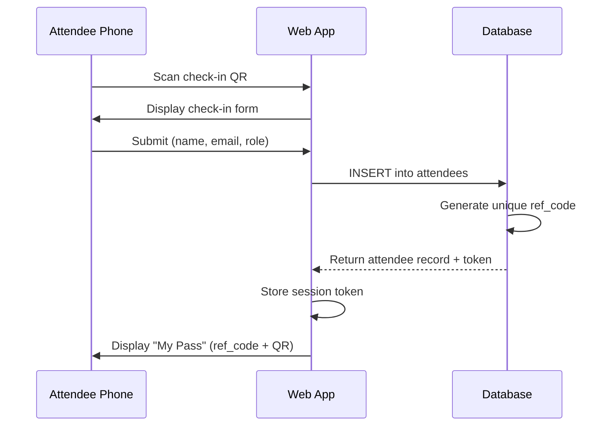
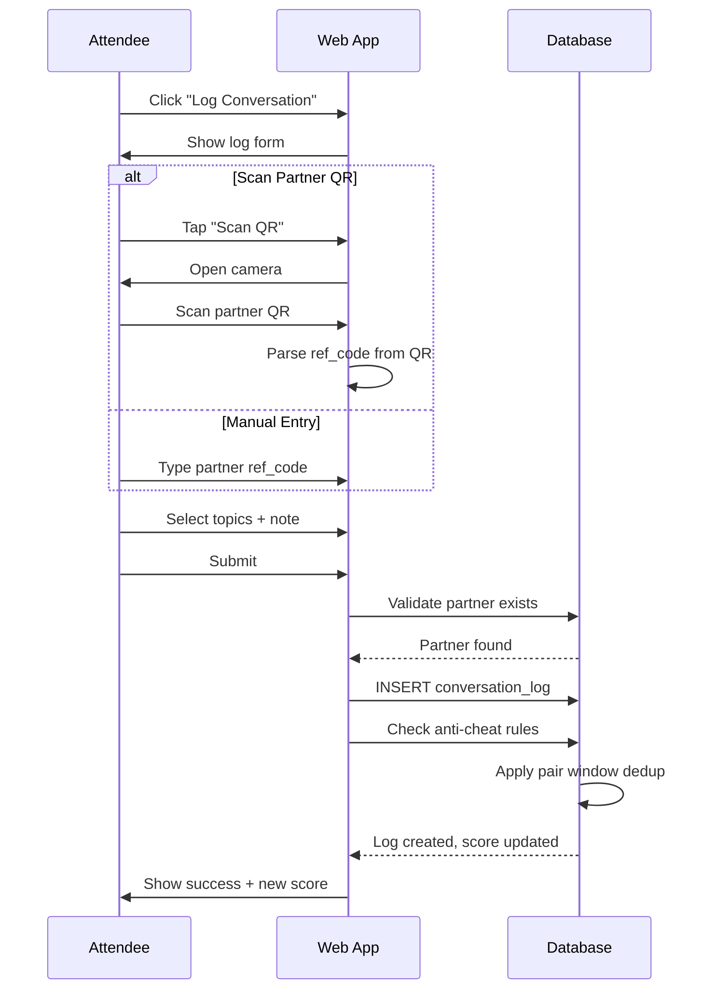
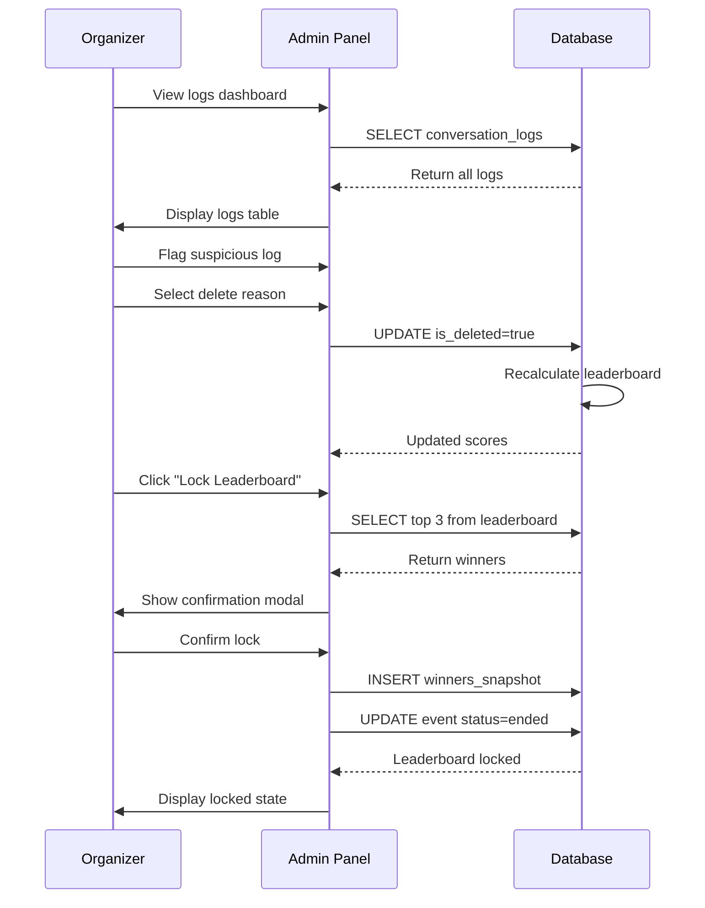
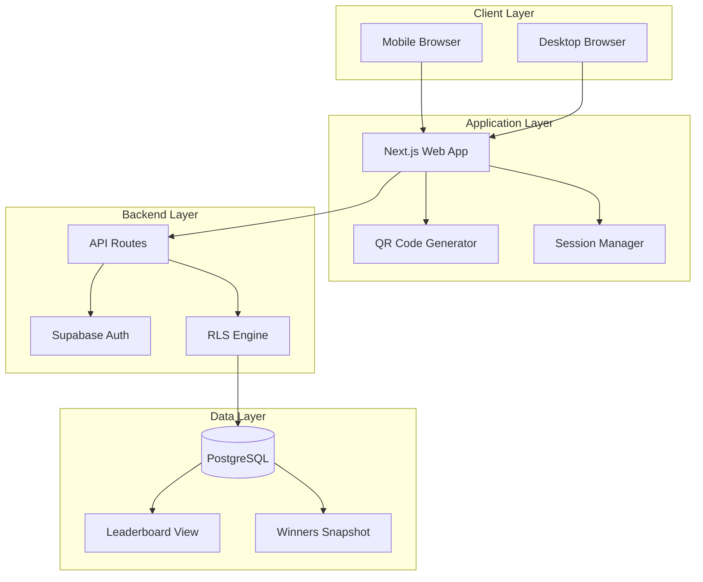
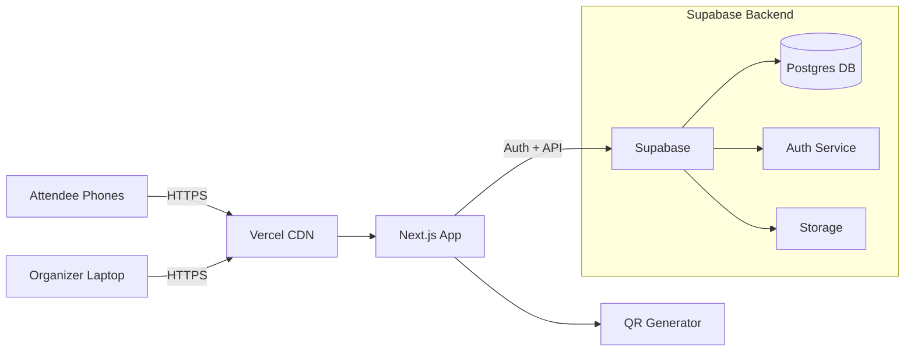

# Converge — Complete Product & Technical Specification

**Product:** Converge  
**Type:** Mobile-friendly Web App (PWA-style)  
**Version:** 1.1 (MVP + Addenda)  
**Last Updated:** February 2026

---

## Table of Contents

### Part I: Product Foundation
1. [Problem & Goal](#1-problem--goal)
2. [Target Users](#2-target-users)
3. [Scope Definition](#3-scope-definition)
4. [Core User Flows](#4-core-user-flows)
5. [Information Architecture](#5-information-architecture)

### Part II: Technical Architecture
6. [Data Model & Database Schema](#6-data-model--database-schema)
7. [Scoring & Leaderboard Rules](#7-scoring--leaderboard-rules)
8. [Anti-Cheat & Validation](#8-anti-cheat--validation)
9. [System Architecture](#9-system-architecture)
10. [Component Diagram](#10-component-diagram)
11. [Security & Privacy](#11-security--privacy)

### Part III: Implementation Details
12. [API Contract](#12-api-contract)
13. [Admin Dashboard Requirements](#13-admin-dashboard-requirements)
14. [Event Operations Guide](#14-event-operations-guide)
15. [MVP Acceptance Criteria](#15-mvp-acceptance-criteria)

### Part IV: UI/UX Specifications
16. [Wireframe Specifications](#16-wireframe-specifications)
17. [Admin Interface Wireframes](#17-admin-interface-wireframes)
18. [Partner QR Scan Design](#18-partner-qr-scan-design)

### Part V: Security Implementation
19. [Row-Level Security (RLS) Plan](#19-row-level-security-rls-plan)
20. [Leaderboard View Definition](#20-leaderboard-view-definition)
21. [Display Privacy Rules](#21-display-privacy-rules)

### Part VI: Process Flows
22. [Sequence Diagrams](#22-sequence-diagrams)
23. [Verification & Anti-Cheat Upgrades](#23-verification--anti-cheat-upgrades)

### Part VII: Business & Operations
24. [Product Positioning](#24-product-positioning)
25. [Day-of-Event Operational Checklist](#25-day-of-event-operational-checklist)
26. [Winner Snapshot Definition](#26-winner-snapshot-definition)
27. [Future Enhancements Roadmap](#27-future-enhancements-roadmap)

### Part VIII: Reference Materials
28. [Open Decisions](#28-open-decisions)
29. [Pre-Implementation Checklist](#29-pre-implementation-checklist)
30. [Appendix A: Reference Code Format](#30-appendix-a-reference-code-format)
31. [Appendix B: Topic Tags](#31-appendix-b-topic-tags)

---

# Part I: Product Foundation

## 1) Problem & Goal

### Problem Statement
At workshops and seminars with roundtable networking, organizers face several challenges:
- Making check-in fast and reliable
- Encouraging *meaningful* networking (not just attendance)
- Tracking who interacted with whom and what they discussed
- Rewarding top participants fairly (identifying top 3 winners)

### Goal Statement
Build a lightweight web application that:
1. Registers attendees at check-in and assigns them a unique **Reference ID** (with optional QR code)
2. Enables attendees to **log conversations** during roundtable sessions
3. Produces an **engagement leaderboard** and identifies **top 3 winners** for giveaways
4. Provides an **admin dashboard** for organizers to monitor, export, and moderate activity

---

## 2) Target Users

### Primary User: Attendee (Student / Guest)
**Needs:**
- Quick check-in process
- Friction-free conversation logging
- Ability to view their score and progress (optional)

**Characteristics:**
- Mobile-first users
- Limited technical expertise required
- Time-constrained during event

### Secondary User: Organizer / Admin
**Needs:**
- Create and manage events
- Oversee check-in flow
- Monitor live leaderboard
- Validate suspicious activity
- Export winners and participant lists

**Characteristics:**
- Laptop/desktop users
- Requires moderate technical comfort
- Responsible for event success

---

## 3) Scope Definition

### MVP Features (Must Have)

#### Core Functionality
- Event landing page with QR entry point
- Check-in form that creates attendee record with reference ID
- Conversation logging form with:
  - "My reference ID" (auto-populated from session)
  - "Person I talked to" (enter reference ID or choose from list)
  - "What we talked about" (topic selection + optional note)
  - Automatic timestamp capture
- Real-time leaderboard page displaying top participants
- Admin dashboard featuring:
  - Participant and log viewing
  - Flag/delete suspicious logs (soft delete)
  - CSV export (participants, logs, winners)
- Basic anti-cheat rule enforcement

#### Technical Requirements
- Mobile-responsive design
- Works in browser (no app download)
- Real-time data updates
- Secure data handling

### Post-MVP Features (Nice to Have)

#### Enhanced Authentication
- Email/OTP login for stronger identity verification
- Multi-factor authentication options

#### Improved User Experience
- QR badge generation for attendees (scan partner instead of typing ID)
- "Conversation confirmed" feature (mutual approval by both parties)
- Session scheduling: round #1, #2, #3 tracking

#### Advanced Features
- Sponsor branding and custom event templates
- Analytics dashboard with:
  - Topics heatmap
  - Engagement funnel visualization
  - Participation trends
- Integration with external platforms

---

## 4) Core User Flows

### 4.1 Attendee Journey: Check-In Process

**Steps:**
1. Attendee scans QR code at check-in table
2. Opens Converge event page in mobile browser
3. Completes check-in form (name, email, optional role)
4. Receives confirmation with:
   - Reference ID (e.g., `CVG-7K2P`)
   - Optional QR code encoding their reference ID
5. Clicks "Continue" to proceed to "Log a Conversation" screen

**Expected Duration:** < 60 seconds  
**Success Criteria:** Attendee has visible reference ID and understands next steps

### 4.2 Attendee Journey: Log Conversation

**Steps:**
1. Select "Log Conversation" from main menu
2. Enter or scan the other person's reference ID
3. Select relevant topic(s) from predefined list
4. Add optional short note (max 180 characters)
5. Submit conversation log
6. View confirmation and updated points (optional display)

**Expected Duration:** < 30 seconds  
**Success Criteria:** Conversation logged successfully, points updated

### 4.3 Organizer Journey: Winner Selection

**Steps:**
1. Access Admin dashboard
2. Review real-time leaderboard
3. Apply filters and validation rules:
   - Check for unique partners
   - Identify suspicious submission rates
4. Lock leaderboard at designated end time
5. Announce top 3 winners to audience

**Expected Duration:** 5-10 minutes  
**Success Criteria:** Fair winner selection, exportable results

---

## 5) Information Architecture

### Public Pages (Attendee-Facing)

#### Event Pages
- **`/e/{eventSlug}`** — Event landing page
  - Event information display
  - CTAs: Check In / Log Conversation
  
- **`/e/{eventSlug}/checkin`** — Check-in form
  - Registration fields
  - Reference ID generation
  
- **`/e/{eventSlug}/me`** — "My Pass" page
  - Displays reference ID
  - Shows QR code
  - Personal stats (optional)
  
- **`/e/{eventSlug}/log`** — Conversation logging form
  - Partner identification
  - Topic selection
  - Note entry
  
- **`/e/{eventSlug}/leaderboard`** — Public leaderboard
  - Top participants ranking
  - Scores and metrics
  - Optional privacy mode

### Admin Pages (Organizer-Facing)

#### Administration Interface
- **`/admin/login`** — Admin authentication
  - Password or magic link login
  
- **`/admin/events/{eventId}`** — Event dashboard
  - Overview metrics
  - Quick actions
  
- **`/admin/events/{eventId}/participants`** — Participant management
  - Full attendee list
  - Search and filter
  
- **`/admin/events/{eventId}/logs`** — Conversation log management
  - All logged conversations
  - Moderation tools
  
- **`/admin/events/{eventId}/leaderboard`** — Leaderboard administration
  - Lock/unlock functionality
  - Winner selection
  
- **`/admin/events/{eventId}/exports`** — Data export center
  - CSV downloads
  - Custom report generation

---

# Part II: Technical Architecture

## 6) Data Model & Database Schema

> **Recommended Technology:** PostgreSQL (via Supabase) for speed and relational integrity

### Table: `events`

**Purpose:** Store event configuration and metadata

| Column | Type | Constraints | Description |
|--------|------|-------------|-------------|
| `id` | uuid | PRIMARY KEY | Unique event identifier |
| `name` | text | NOT NULL | Event display name |
| `slug` | text | UNIQUE, NOT NULL | URL-friendly identifier |
| `location` | text | | Physical location (e.g., "MU Ventana") |
| `start_time` | timestamp | NOT NULL | Event start date/time |
| `end_time` | timestamp | NOT NULL | Event end date/time |
| `status` | enum | NOT NULL | Values: draft, live, ended |
| `settings` | jsonb | | Scoring rules, anti-cheat parameters |
| `created_at` | timestamp | DEFAULT NOW() | Record creation time |
| `updated_at` | timestamp | DEFAULT NOW() | Last modification time |

**Indexes:**
- `idx_events_slug` on `slug`
- `idx_events_status` on `status`

---

### Table: `attendees`

**Purpose:** Store participant information

| Column | Type | Constraints | Description |
|--------|------|-------------|-------------|
| `id` | uuid | PRIMARY KEY | Unique attendee identifier |
| `event_id` | uuid | FOREIGN KEY → events.id | Associated event |
| `ref_code` | text | UNIQUE per event | Reference code (e.g., "CVG-7K2P") |
| `name` | text | NOT NULL | Full name |
| `email` | text | OPTIONAL | Email address (can enforce domain) |
| `role` | enum | OPTIONAL | Values: student, speaker, organizer, guest |
| `checked_in_at` | timestamp | NOT NULL | Check-in timestamp |
| `is_active` | boolean | DEFAULT true | Account status flag |
| `created_at` | timestamp | DEFAULT NOW() | Record creation time |

**Indexes:**
- `idx_attendees_event_id` on `event_id`
- `idx_attendees_ref_code` on `ref_code`
- `idx_attendees_email` on `email`

**Constraints:**
- UNIQUE(`event_id`, `ref_code`)
- UNIQUE(`event_id`, `email`) if email is required

---

### Table: `conversation_logs`

**Purpose:** Store all conversation interactions

| Column | Type | Constraints | Description |
|--------|------|-------------|-------------|
| `id` | uuid | PRIMARY KEY | Unique log identifier |
| `event_id` | uuid | FOREIGN KEY → events.id | Associated event |
| `from_attendee_id` | uuid | FOREIGN KEY → attendees.id | Person submitting log |
| `to_ref_code` | text | NOT NULL | Partner's reference code (raw) |
| `to_attendee_id` | uuid | NULLABLE, FK → attendees.id | Resolved partner ID |
| `topics` | text[] or jsonb | | Selected topics (e.g., ["MVP", "Funding"]) |
| `note` | text | OPTIONAL | Conversation note (max ~180 chars) |
| `round_label` | text | OPTIONAL | Round identifier (e.g., "Round 1") |
| `created_at` | timestamp | DEFAULT NOW() | Log submission time |
| `is_deleted` | boolean | DEFAULT false | Soft delete flag |
| `deleted_reason` | text | OPTIONAL | Reason for deletion |

**Indexes:**
- `idx_conversation_logs_event_id` on `event_id`
- `idx_conversation_logs_from_attendee_id` on `from_attendee_id`
- `idx_conversation_logs_to_attendee_id` on `to_attendee_id`
- `idx_conversation_logs_created_at` on `created_at`

**Constraints:**
- CHECK(length(note) <= 180)

---

### Table: `admin_users`

**Purpose:** Store administrative user credentials

| Column | Type | Constraints | Description |
|--------|------|-------------|-------------|
| `id` | uuid | PRIMARY KEY | Unique admin identifier |
| `email` | text | UNIQUE, NOT NULL | Admin email address |
| `password_hash` | text | | Hashed password OR magic link token |
| `created_at` | timestamp | DEFAULT NOW() | Account creation time |

**Note:** Alternative authentication via magic link/token auth system

---

### Table: `audit_actions` (Optional but Recommended)

**Purpose:** Track administrative actions for accountability

| Column | Type | Constraints | Description |
|--------|------|-------------|-------------|
| `id` | uuid | PRIMARY KEY | Unique audit identifier |
| `admin_user_id` | uuid | FOREIGN KEY → admin_users.id | Admin who performed action |
| `event_id` | uuid | FOREIGN KEY → events.id | Associated event |
| `action` | text | NOT NULL | Action type (e.g., "DELETE_LOG", "LOCK_EVENT") |
| `payload` | jsonb | | Additional action details |
| `created_at` | timestamp | DEFAULT NOW() | Action timestamp |

**Indexes:**
- `idx_audit_actions_event_id` on `event_id`
- `idx_audit_actions_admin_user_id` on `admin_user_id`
- `idx_audit_actions_created_at` on `created_at`

---

## 7) Scoring & Leaderboard Rules

### Scoring Objectives
- Reward **unique connections** over repeated interactions
- Encourage **substantive conversation detail**
- Prevent spam and gaming behavior

### Score Calculation (MVP Formula)

#### Per-Attendee Metrics

**1. Unique Partners Count**
```
unique_partners = COUNT(DISTINCT to_attendee_id OR to_ref_code)
```
- Counts distinct people the attendee conversed with
- Duplicate conversations with same person don't increase this count

**2. Valid Logs Count**
```
valid_logs = COUNT(conversation_logs WHERE is_deleted = false)
```
- Total number of non-deleted conversation logs

**3. Detail Bonus Count**
```
detail_bonus = COUNT(logs WHERE note_length >= 20 OR topic_count >= 2)
```
- Rewards logs with either:
  - Note of 20+ characters, OR
  - 2 or more topics selected

#### Final Score Formula
```
score = (unique_partners × 2) + (detail_bonus × 1)
```

**Weighting Rationale:**
- Unique partners weighted 2x to prioritize breadth of networking
- Detail bonus weighted 1x to encourage quality engagement

### Tie-Breaking Rules (Applied in Order)

1. **Higher unique_partners** — Attendee who met more unique people wins
2. **Higher detail_bonus** — Attendee with more detailed logs wins
3. **Earlier completion time** — Earlier timestamp of last valid log wins (encourages early participation)

### Leaderboard Lock Feature

**Purpose:** Freeze final standings at event conclusion

**Functionality:**
- Admin triggers "Lock" action at event end
- System creates snapshot of current top 3 winners
- Locked standings become immutable
- Post-lock edits don't affect winner determination

---

## 8) Anti-Cheat & Validation

### MVP Anti-Cheat Rules

#### Rule 1: Pair Window Deduplication
**Objective:** Prevent spam logging of same partner

**Implementation:**
- Only **first log** between a pair within time window counts for scoring
- Default window: **30 minutes** (configurable per event)
- Subsequent logs within window are stored but don't increase score
- Example: If Attendee A logs Attendee B at 7:10 PM and again at 7:12 PM, only the 7:10 PM log counts

**Technical Note:** Keep all logs for audit trail; flag which ones contribute to score

#### Rule 2: Per-Attendee Cap (Optional)
**Objective:** Prevent single attendee domination

**Implementation:**
- Set maximum scoring conversations per round (e.g., 10)
- Configurable via event settings
- Excess logs stored but marked as non-scoring

#### Rule 3: Partner Existence Verification
**Objective:** Ensure logged partners are real attendees

**Options:**

**Option A (Strict):**
- Only count logs where `to_attendee_id` is resolved (partner checked in)
- Logs with unresolved partners marked as "unverified"
- Unverified logs don't contribute to score

**Option B (Lenient):**
- Allow scoring for unresolved partners initially
- Resolve and validate later
- Remove points if partner never checks in

**Recommended for MVP:** Option A (strict) — cleaner logic, prevents fake partners

#### Rule 4: Admin Moderation
**Objective:** Human oversight for edge cases

**Functionality:**
- Admins can soft-delete any suspicious log
- Deletion reasons tracked in audit log
- Leaderboard automatically recalculates after moderation
- Deleted logs don't contribute to score but remain in database

### Spam Detection Indicators (For Admin Review)

**Red Flags:**
- Same attendee logging >15 conversations in <30 minutes
- Identical notes across multiple logs
- Partner reference codes that don't exist
- Abnormally high activity from single device/IP
- Logs submitted outside event time window

**Admin Dashboard Should Highlight:**
- Attendees with suspicious submission patterns
- Logs flagged by automated rules
- Recent high-velocity logging activity

---


# Part III: Implementation Details

## 12) API Contract

> **Note:** Can be implemented as REST API or via Supabase client. Below are the conceptual operation shapes.

### Public API Endpoints

#### POST /api/checkin
**Purpose:** Register a new attendee at check-in

**Request Body:**
```json
{
  "eventSlug": "string",
  "name": "string",
  "email": "string (optional)",
  "role": "student | guest | speaker | organizer (optional)"
}
```

**Response:**
```json
{
  "refCode": "string (e.g., CVG-7K2P)",
  "attendeeId": "uuid",
  "sessionToken": "string (for subsequent requests)"
}
```

**Status Codes:**
- 201: Created successfully
- 400: Invalid input (missing required fields)
- 404: Event not found
- 409: Email already registered (if enforcing unique emails)

---

#### POST /api/log
**Purpose:** Submit a conversation log

**Request Body:**
```json
{
  "eventSlug": "string",
  "fromRefCode": "string",
  "toRefCode": "string",
  "topics": ["string"],
  "note": "string (optional, max 180 chars)",
  "roundLabel": "string (optional)"
}
```

**Response:**
```json
{
  "success": true,
  "logId": "uuid",
  "computedScore": 15 (optional)
}
```

**Status Codes:**
- 201: Log created successfully
- 400: Invalid input
- 401: Unauthorized (invalid session token)
- 404: Event or partner not found
- 429: Rate limit exceeded

# Converge Specification (Continued)

## Continuation from Part III

### GET /api/leaderboard?eventSlug={slug}
**Purpose:** Retrieve current leaderboard standings

**Query Parameters:**
- `eventSlug` (required): Event identifier
- `limit` (optional): Number of results (default: 10)

**Response:**
```json
{
  "eventName": "string",
  "isLocked": false,
  "leaderboard": [
    {
      "rank": 1,
      "refCode": "CVG-7K2P",
      "displayName": "John D.",
      "score": 25,
      "uniquePartners": 10,
      "detailBonus": 5
    }
  ]
}
```

---

### Admin API Endpoints

#### GET /api/admin/events/{id}/participants
**Purpose:** Retrieve all participants for an event

**Authentication:** Required (admin token)

#### GET /api/admin/events/{id}/logs
**Purpose:** Retrieve all conversation logs

#### POST /api/admin/events/{id}/logs/{logId}/delete
**Purpose:** Soft delete a suspicious log

#### POST /api/admin/events/{id}/lock
**Purpose:** Lock leaderboard and finalize winners

#### GET /api/admin/events/{id}/export?type={exportType}
**Purpose:** Export event data as CSV

Export Formats:
- **Participants CSV:** name, ref_code, email, role, checked_in_at
- **Logs CSV:** from_ref, from_name, to_ref, to_name, topics, note, timestamp, is_deleted
- **Winners CSV:** rank, name, ref_code, score, unique_partners, detail_bonus

---

# Part IV: UI/UX Specifications

## 16) Wireframe Specifications

### 16.1 Event Landing Page — `/e/{eventSlug}`

**Purpose:** Single entry point explaining the flow

**Header:**
- Event Title (large, bold)
- Date & Time + Location

**Instructions (3-Step Flow):**
1. Check In → Get your Ref Code
2. Network & Log → Meet people and log conversations
3. Win Prizes → Top 3 participants win

**CTAs:**
- Primary: "Check In Now"
- Secondary: "Log a Conversation"
- Tertiary: "View Leaderboard"

**Footer Microcopy:**
- "No download needed. Works in your browser."
- "Prizes for top 3 most engaged participants."

---

### 16.2 Check-In Form — `/e/{eventSlug}/checkin`

**Form Fields:**
1. Full Name (required)
2. Email (required/optional based on config)
3. Role (optional dropdown): Student / Guest / Speaker / Organizer

**Action:** "Generate My Pass" button

**Success State:** Redirects to My Pass page with ref code

---

### 16.3 My Pass Page — `/e/{eventSlug}/me`

**Main Content:**
- Ref Code: `CVG-7K2P` (large text)
- QR Code (200×200px minimum)
- Copy Button
- Optional: Personal stats (score, people met)

**Actions:**
- Primary: "Log a Conversation"
- Secondary: "View Leaderboard"

---

### 16.4 Log Conversation Page — `/e/{eventSlug}/log`

**Two Input Modes:**

**Mode 1: Scan Partner QR**
- Button opens camera modal
- Alignment guide overlay
- Fallback to manual entry

**Mode 2: Manual Entry**
- Input: "Partner Ref Code"
- Placeholder: "CVG-____"

**Topic Selection (Multi-select chips):**
- Idea validation, MVP, Funding, Pitching, Cofounder, Growth, Tech, Design, Legal, Mentorship, Career

**Optional Note:**
- Textarea, 180 char limit
- Character counter

**Round Label (Optional dropdown):**
- Round 1, Round 2, Round 3, Other

**Submit:** "Submit Log" button

**Success State:**
- ✅ "Logged!"
- Summary of conversation
- Actions: "Log Another" / "Back to My Pass"

---

### 16.5 Leaderboard Page — `/e/{eventSlug}/leaderboard`

**Display:**
- Top 10 (or more) participants
- Columns: Rank, Name, Score, Connections, Detail Bonus
- Top 3 highlighted with medal icons

**Privacy Toggle:**
- "Show only Ref Codes" option

**Footer:** "Score = (unique connections × 2) + (meaningful details × 1)"

**Auto-refresh:** Every 30 seconds during live event

---

## 17) Admin Interface Wireframes

### 17.1 Admin Dashboard — `/admin/events/{eventId}`

**Metrics Cards:**
1. Total Checked In
2. Total Logs
3. Unique Pairs
4. Suspicious Logs

**Actions:**
- Go Live / End Event
- Lock Leaderboard
- Export Data

---

### 17.2 Participants View

**Table:** Ref Code | Name | Email | Role | Checked-in Time | Status

**Features:**
- Search and filter
- Disable attendee
- View attendee's logs

---

### 17.3 Logs View

**Table:** Time | From | To | Topics | Note | Status

**Moderation:**
- Soft delete with reason
- Restore deleted logs
- Filter by status

---

### 17.4 Leaderboard + Winners

**Features:**
- Live updates
- Lock button
- Export top 3
- Winner snapshot display

---

## 18) Partner QR Scan Design

### Goal
Remove manual ref code typing for faster logging

### Flow
1. Student opens "My Pass"
2. Partner opens "My Pass"
3. In "Log Conversation", tap "Scan Partner QR"
4. Camera scans partner QR → auto-fills ID
5. Select topics + note → submit

### QR Payload Options

**Option A (Simple):** Encode `ref_code` directly
- QR contains: `CVG-7K2P`
- Pros: Easiest implementation
- Cons: Visible to anyone

**Option B (Better):** Encode public attendee token
- QR contains: UUID or `ref_code + checksum`
- Pros: Harder to fake
- Cons: More setup

**Recommended for MVP:** Option A with validation (partner must exist)

### Implementation
- Use device camera in web app
- Modal with camera preview
- Alignment guide
- Fallback to manual entry

---

# Part V: Security Implementation

## 19) Row-Level Security (RLS) Plan

### Authentication Approach (MVP)

**Attendee Session Token:**
- On check-in, server creates attendee + returns session token
- Token stored in localStorage
- Every log submission includes token
- Backend verifies token before allowing operations

**Alternative (Post-MVP):** Supabase Auth magic link for stronger identity

---

### RLS Rules by Table

#### Table: `events`
- **Public read:** Basic fields for live events (name, slug, location, start/end, status)
- **Admin:** Full read/write

#### Table: `attendees`
- **Public/Attendee:**
  - Insert allowed only if event is live
  - Read: Attendee can read their own record only
- **Admin:** Full read/write
- **Privacy:** Email addresses not publicly readable

#### Table: `conversation_logs`
- **Attendee:**
  - Insert only if event is live
  - from_attendee_id must match their ID (via session token)
  - Read: Own logs only (or none)
- **Admin:** Full read/write, including soft delete

#### Leaderboard View (Public)
- Expose only aggregated data
- Never expose raw logs or emails
- Use database view for security

---

## 20) Leaderboard View Definition

### Purpose
Expose only aggregated results, keeping raw data private

### View Returns (Per Attendee)
- event_id
- attendee_id
- ref_code (or masked name)
- display_name (First name + last initial)
- score (computed)
- unique_partners (computed)
- detail_bonus (computed)
- total_valid_logs (computed)
- last_activity_at (for tie-breakers)

**Never includes:** emails, notes

---

### Valid Log Criteria
A log counts if:
- is_deleted = false
- Belongs to the same event
- Passes anti-cheat filters

---

### Unique Partners Calculation
For each attendee:
1. Get all valid logs where from_attendee_id = attendee_id
2. Group by partner (to_attendee_id preferred, to_ref_code as fallback)
3. Count distinct partners
4. **Recommended:** Only count if to_attendee_id is not null (partner exists)

---

### Detail Bonus Calculation
A log earns detail bonus if:
- 2+ topics selected, OR
- Note length ≥ 20 characters

Then: detail_bonus = count(qualifying logs)

---

### Anti-Cheat: Pair Window
- Only first log between a pair within time window counts for scoring
- Default: 30-minute window
- Example: A logs B at 7:10 PM and 7:12 PM → only 7:10 PM counts
- Implementation: Exclude logs within 30 min of previous counted log for same pair

---

### Score Formula
```
Score = (unique_partners × 2) + (detail_bonus × 1)
```

**Tie-breakers:**
1. Higher unique_partners
2. Higher detail_bonus
3. Earlier last_activity_at

---

## 21) Display Privacy Rules

### Public Leaderboard Page
- Show: ref_code + score OR first name + last initial
- **Never show:** email addresses
- **Never show:** conversation notes publicly

### Admin Dashboard
- Can view: Everything (including notes)
- Responsibility: Notes should be short and non-sensitive

---

# Part VI: Process Flows

## 22) Sequence Diagrams

### 22.1 Attendee Check-In Flow



---

### 22.2 Log Conversation Flow



---

### 22.3 Admin Moderation & Leaderboard Lock



---

## 23) Verification & Anti-Cheat Upgrades

### Rule: One Scoring Log Per Pair Per Time Window
- If A logs B at 7:10pm and 7:12pm → only first counts for score
- Default window: 30 minutes
- Subsequent logs stored but don't increase score

### Optional Stronger Rule: Mutual Confirmation (Post-MVP)
**Flow:**
1. A logs conversation with B → status "Pending"
2. B receives notification: "Confirm you talked to A?"
3. B confirms → log status "Confirmed"
4. Only confirmed logs count for scoring

**Trade-off:**
- Pros: Very fair, prevents one-sided claims
- Cons: Increases friction, may reduce participation

**Recommendation:** Post-MVP feature for business version

---

# Part VII: Business & Operations

## 24) Product Positioning

### One-Liner
Converge is a QR-based engagement platform that helps events track meaningful networking and reward participation—without app downloads.

---

### Ideal Customers (Early Adopters)

**Target Segments:**
1. **Universities / Student Organizations**
   - Startup clubs, entrepreneurship programs
   - Career fairs, networking events
   
2. **Meetup Organizers**
   - Professional networking groups
   - Industry-specific meetups
   
3. **Startup Demo Days**
   - Pitch competitions
   - Investor networking events
   
4. **Conferences with Roundtables**
   - Breakout sessions
   - Structured networking

---

### Pricing Idea (Future)

**Free Tier:**
- 1 event per month
- Up to 100 attendees
- Basic leaderboard
- Limited exports

**Pro Tier ($49-99/month):**
- Unlimited events
- Unlimited attendees
- Advanced analytics
- Partner confirmations
- Custom branding
- API access

**Enterprise (Custom):**
- White-label solution
- Dedicated support
- Custom integrations
- Multi-event management

---

## 25) Day-of-Event Operational Checklist

### Before Event (1–2 Days)
- [ ] Create event in admin panel
- [ ] Set status to DRAFT
- [ ] Configure email policy and scoring rules
- [ ] Print QR posters (check-in + log)
- [ ] Test on iPhone Safari
- [ ] Test on Android Chrome
- [ ] Test admin dashboard on laptop

---

### Right Before Doors Open
- [ ] Switch event to LIVE
- [ ] Test one real check-in
- [ ] Test one real log
- [ ] Confirm leaderboard updates
- [ ] Display QR codes prominently

---

### During Roundtables
- [ ] Remind students to log after each round
- [ ] Assign 1 helper for troubleshooting
- [ ] Monitor admin dashboard for spam
- [ ] Flag suspicious activity

---

### End of Event
- [ ] Lock leaderboard
- [ ] Export top 3 winners CSV
- [ ] Announce winners
- [ ] Export participant list
- [ ] Send follow-up emails

---

## 26) Winner Snapshot Definition

### Purpose
When admin locks the leaderboard, create immutable record of winners

### Snapshot Contains
- event_id
- locked_at (timestamp)
- Rank 1/2/3:
  - attendee_id
  - ref_code
  - name
  - score
  - unique_partners
  - detail_bonus

### Behavior
- Winners don't change even if logs are edited post-lock
- Provides audit trail
- Enables historical winner queries

---

## 27) Future Enhancements Roadmap

### Post-MVP Features

#### Phase 1: Reliability Improvements
- [ ] Partner confirmation (mutual approval)
- [ ] Scan partner QR (camera integration)
- [ ] Offline mode (local storage + sync)

#### Phase 2: Analytics & Insights
- [ ] Topic analytics dashboard
- [ ] Heatmap of popular conversation topics
- [ ] Engagement funnel visualization
- [ ] Time-series participation graphs

#### Phase 3: Business Features
- [ ] Sponsor branding options
- [ ] Multiple event templates
- [ ] White-label solution
- [ ] Custom domain support

#### Phase 4: Integrations
- [ ] Google Sheets auto-export
- [ ] Slack notifications for organizers
- [ ] Email marketing platform integration
- [ ] Badge printing integration

#### Phase 5: Advanced Features
- [ ] Session scheduling (multi-round tracking)
- [ ] Team competitions
- [ ] Real-time announcements
- [ ] Mobile app (iOS/Android)

---

# Part VIII: Reference Materials

## 28) Open Decisions

### Questions to Decide Later

**1. Email Requirement**
- Should emails be required?
- If yes, enforce ASU-only (@asu.edu) or allow all?
- Privacy consideration: optional email increases accessibility

**2. Leaderboard Visibility**
- Should leaderboards be public or admin-only?
- Option: Let organizers choose per event

**3. Unverified Partner Logs**
- Should logs with unverified toRefCode count for scoring?
- Option A: No (recommended for MVP)
- Option B: Yes, but flag as unverified

**4. Speaker/Organizer Treatment**
- Should speakers/organizers appear in attendee list?
- Option: Separate role with different scoring (or no scoring)

**5. Data Retention**
- How long to keep event data after completion?
- Options: 30 days, 90 days, indefinitely, user-configurable

---

## 29) Pre-Implementation Checklist

### Design Checklist
- [ ] Mobile-first UI design (big buttons, minimal typing)
- [ ] QR poster copy and layout
- [ ] Badge/sticker design (optional)
- [ ] Email templates (confirmation, follow-up)
- [ ] Error message copy

---

### Engineering Checklist
- [ ] Event creation flow (admin panel)
- [ ] Ref code generation algorithm
- [ ] Leaderboard query optimization
- [ ] Soft delete & audit logging
- [ ] Rate limiting implementation
- [ ] Session token security
- [ ] RLS policy creation
- [ ] Database indexes
- [ ] CSV export formatting

---

### Testing Checklist (Day-of Reliability)
- [ ] iPhone Safari camera permissions
- [ ] Android Chrome camera permissions
- [ ] Works on weak Wi-Fi
- [ ] Rate limit testing
- [ ] Concurrent user testing
- [ ] Database backup before event
- [ ] Admin emergency access

---

## 30) Appendix A: Reference Code Format

### Recommended Format
**Pattern:** `CVG-XXXX`

**Components:**
- Prefix: `CVG` (Converge)
- Separator: `-`
- Random part: 4 characters (alphanumeric)

**Examples:**
- `CVG-7K2P`
- `CVG-19FQ`
- `CVG-A3M7`

**Characteristics:**
- Human-friendly
- Easy to type
- Case-insensitive
- Avoid ambiguous characters (0/O, 1/I/l)

**Character Set:**
- Uppercase letters: A-Z (exclude O, I)
- Numbers: 2-9 (exclude 0, 1)
- Total: 32 possible characters per position
- Combinations: 32^4 = 1,048,576 unique codes per event

**Generation Logic:**
```javascript
function generateRefCode() {
  const chars = '23456789ABCDEFGHJKLMNPQRSTUVWXYZ';
  const random = Array.from({length: 4}, () => 
    chars[Math.floor(Math.random() * chars.length)]
  ).join('');
  return `CVG-${random}`;
}
```

---

## 31) Appendix B: Topic Tags

### Starter Topic Set (12 Tags)

**Product & Validation:**
1. Idea validation
2. MVP / Product building
3. Customer discovery

**Funding & Growth:**
4. Pitching
5. Funding (VC, angel, grants)
6. Growth / Marketing

**Team & Skills:**
7. Team / Cofounder
8. Tech / Engineering
9. Design / UX

**Business Operations:**
10. Legal / Incorporation

**Career & Networking:**
11. Career / Internships
12. Networking / Mentorship

---

### Optional: Expandable Topic System (Post-MVP)

**Allow organizers to:**
- Add custom topics per event
- Specify industry-specific tags
- Create topic hierarchies

**Example for Healthcare Event:**
- Digital Health
- Clinical Trials
- Regulatory Compliance
- Patient Engagement
- Telehealth
- Medical Devices

---

## System Architecture Diagram

### 10) Component Diagram (Logical)



---

## System Architecture (High-Level)

### 9) System Architecture

**Recommended Stack:**
- **Frontend:** Next.js / React (mobile-first design)
- **Backend:** Supabase (Auth + Postgres + RLS)
- **Hosting:** Vercel (serverless deployment)
- **QR Generation:** Client-side or server-side library
- **File Storage:** Supabase Storage (for exports)

**Architecture Benefits:**
- **Speed:** Serverless edge functions
- **Security:** Row-level security built-in
- **Scalability:** Auto-scaling with Vercel
- **Cost:** Free tier sufficient for MVP testing

---

### Infrastructure Diagram



---

## End of Specification

**Document Version:** 1.1  
**Total Sections:** 31  
**Last Updated:** February 2026

**Next Steps:**
1. Review and approve specification
2. Set up development environment
3. Create database schema
4. Build MVP features
5. Conduct testing
6. Deploy for first event

---

### Document Change Log

**v1.1 (February 2026):**
- Added wireframe specifications
- Added RLS security plan
- Added partner QR scan design
- Added sequence diagrams
- Added leaderboard view definition
- Added operational checklists

**v1.0 (Initial):**
- Core product specification
- Database schema
- API contract
- Basic requirements

---

**For questions or clarifications, contact:** [Your contact information]

